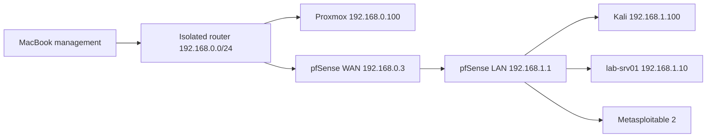

# Enterprise IT & Cybersecurity Homelab

A low-cost, offline-first homelab used to practise infrastructure, networking, Linux administration, troubleshooting, access control, defensive security, and authorised security testing.

The lab runs on refurbished hardware and is documented as evidence-based projects. Each write-up separates the objective, implementation, validation, troubleshooting, and lessons learned.

## Current architecture

- `vmbr0`: physical/WAN and Proxmox management bridge
- `vmbr1`: virtual-only lab bridge with no physical port
- pfSense is the only router between the networks
- The lab router currently has no internet access
- Metasploitable is attached only to `vmbr1`

See the [network architecture](architecture/network-architecture.md) and [asset inventory](architecture/asset-inventory.md).

## Verified projects

| Project | Evidence |
|---|---|
| [01 — Network foundation](projects/01-network-foundation/README.md) | Bridge separation, addressing, DHCP and connectivity |
| [02 — Ubuntu recovery](projects/02-ubuntu-server-recovery/README.md) | Recovery, Netplan, SSH, hostname, reservation and snapshot |
| [03 — Linux RBAC](projects/03-linux-rbac/README.md) | Users, groups, setgid directories and access tests |
| [04 — Privilege escalation](labs/lab-04-privilege-escalation.md) | Existing authorised security-testing write-up |

## Troubleshooting records

- [Ubuntu had no IPv4 address](troubleshooting/ubuntu-network-dhcp.md)
- [Omar could not access the shared directory](troubleshooting/missing-group-membership.md)

## Skills demonstrated

- Proxmox virtualisation and snapshots
- pfSense routing, DHCP and network isolation
- Linux recovery and server administration
- Netplan and layered network troubleshooting
- SSH remote administration
- Linux users, groups, ownership, permissions and setgid
- Evidence-led diagnosis and validation

## Hardware and constraints

Approximately AUD $180: refurbished Intel Core i5-3470 desktop, 8 GB RAM, 128 GB SSD, old router and 2018 MacBook Pro. Limited RAM is handled by running only the VMs needed for each task.

## Documentation standard

Each new project records its objective, environment, implementation, validation, troubleshooting, security considerations, and lessons learned. Passwords, private keys, tokens, unsanitised firewall exports and personal information are never committed.

See [ROADMAP.md](ROADMAP.md) for planned IT operations, automation, blue-team and authorised security work.
