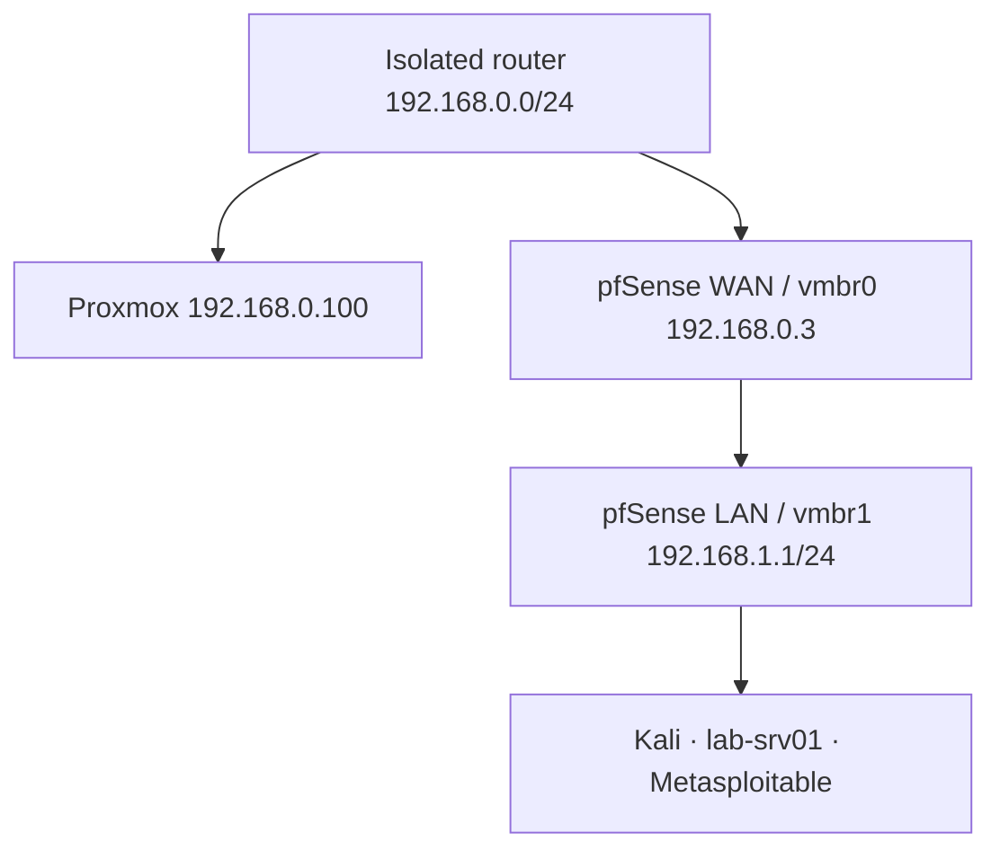

# Network Architecture

## Objective

Keep deliberately vulnerable systems off the physical management network while allowing controlled communication with administration and security VMs.

| Bridge | Physical attachment | Purpose |
|---|---|---|
| `vmbr0` | `nic0` | Proxmox management and pfSense WAN |
| `vmbr1` | None | Virtual-only isolated lab LAN |

pfSense has one virtual NIC on each bridge. Kali, Ubuntu Server and Metasploitable are attached only to `vmbr1`.

## Address plan

| System | Address | Allocation |
|---|---:|---|
| Proxmox | `192.168.0.100/24` | Management |
| pfSense WAN | `192.168.0.3/24` | Physical-router DHCP |
| pfSense LAN | `192.168.1.1/24` | Lab gateway |
| Kali | `192.168.1.100/24` | DHCP |
| Ubuntu `lab-srv01` | `192.168.1.10/24` | DHCP reservation |
| Metasploitable 2 | Not documented | Isolated target |

## Validation

- Confirmed `vmbr1` has no physical port, host IP or gateway.
- Confirmed all lab VMs use `bridge=vmbr1`.
- Confirmed Kali reached pfSense with 0% packet loss.
- Confirmed Ubuntu received DHCP routing through `192.168.1.1`.
- Confirmed SSH from Kali to Ubuntu.

Metasploitable must never be bridged directly to a household, campus or public network.
